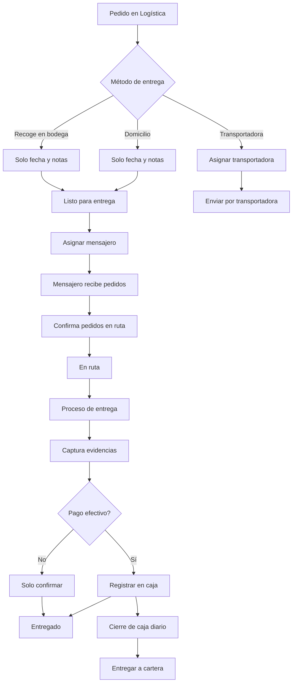

# Plan de Mejoras: Sistema de Entrega y Mensajeros

## 1. PROBLEMA IDENTIFICADO: Modal de Logística

### Situación Actual
- El modal de logística muestra todas las transportadoras disponibles incluso cuando el pedido es "domicilio"
- Para pedidos a domicilio, el mensajero debería asignarse en la etapa de entrega, no en logística

### Solución Propuesta
- Modificar el `LogisticsModal.js` para que:
  - Si `delivery_method === 'domicilio'` → NO mostrar transportadoras
  - Solo permitir confirmar fecha de envío y notas
  - La asignación de mensajero se hará en la etapa de entrega

## 2. NUEVO MÓDULO: Cierre de Caja Mensajeros

### Funcionalidades Requeridas
1. **Registro de entregas en efectivo**
   - Tracking de todos los pagos en efectivo recibidos por cada mensajero
   - Registro automático al marcar pedido como entregado

2. **Cierre diario**
   - Vista para que el mensajero vea el total recaudado del día
   - Botón para "Entregar a cartera"
   - Generación de comprobante de entrega

3. **Vista para cartera**
   - Recepción del dinero del mensajero
   - Confirmación y registro del cierre

### Estructura de Base de Datos
```sql
-- Nueva tabla para cierres de caja
CREATE TABLE messenger_cash_closings (
  id INT PRIMARY KEY AUTO_INCREMENT,
  messenger_id INT NOT NULL,
  closing_date DATE NOT NULL,
  total_amount DECIMAL(10,2) NOT NULL,
  status ENUM('pendiente', 'entregado', 'confirmado') DEFAULT 'pendiente',
  delivered_to_treasury_at DATETIME,
  treasury_user_id INT,
  notes TEXT,
  created_at TIMESTAMP DEFAULT CURRENT_TIMESTAMP,
  updated_at TIMESTAMP DEFAULT CURRENT_TIMESTAMP ON UPDATE CURRENT_TIMESTAMP,
  FOREIGN KEY (messenger_id) REFERENCES users(id),
  FOREIGN KEY (treasury_user_id) REFERENCES users(id)
);

-- Tracking de pagos en efectivo por pedido
CREATE TABLE order_cash_payments (
  id INT PRIMARY KEY AUTO_INCREMENT,
  order_id INT NOT NULL,
  messenger_id INT NOT NULL,
  amount DECIMAL(10,2) NOT NULL,
  collected_at DATETIME NOT NULL,
  closing_id INT,
  created_at TIMESTAMP DEFAULT CURRENT_TIMESTAMP,
  FOREIGN KEY (order_id) REFERENCES orders(id),
  FOREIGN KEY (messenger_id) REFERENCES users(id),
  FOREIGN KEY (closing_id) REFERENCES messenger_cash_closings(id)
);
```

## 3. MEJORAS EN EL MÓDULO DE ENTREGA

### A. Vista del Mensajero - Recepción de Pedidos

```javascript
// Nueva página: MessengerDeliveryPage.js
// Funcionalidades:
- Lista de pedidos asignados (estado: listo_para_entrega)
- Checkbox para seleccionar pedidos a llevar en ruta
- Botón "Confirmar recepción" → cambia estado a "en_ruta"
- Mapa con rutas optimizadas (opcional)
```

### B. Proceso de Entrega

```javascript
// Componente: DeliveryConfirmationModal.js
// Al hacer clic en "Entregar pedido":

1. Captura de evidencias:
   - Foto de la entrega (obligatorio)
   - Foto del dinero recibido (si es efectivo)
   - Firma del cliente (pad de firma digital)
   - Opción "Sin firma" con justificación

2. Confirmación final:
   - Registrar hora de entrega
   - Guardar evidencias
   - Actualizar estado a "entregado"
   - Si es efectivo, registrar en order_cash_payments
```

### C. Estructura de Evidencias

```sql
-- Nueva tabla para evidencias de entrega
CREATE TABLE delivery_evidences (
  id INT PRIMARY KEY AUTO_INCREMENT,
  order_id INT NOT NULL,
  messenger_id INT NOT NULL,
  delivery_photo VARCHAR(255) NOT NULL,
  payment_photo VARCHAR(255),
  signature_image VARCHAR(255),
  no_signature_reason TEXT,
  delivered_at DATETIME NOT NULL,
  gps_latitude DECIMAL(10, 8),
  gps_longitude DECIMAL(11, 8),
  created_at TIMESTAMP DEFAULT CURRENT_TIMESTAMP,
  FOREIGN KEY (order_id) REFERENCES orders(id),
  FOREIGN KEY (messenger_id) REFERENCES users(id)
);
```

## 4. FLUJO COMPLETO ACTUALIZADO



## 5. ARCHIVOS A MODIFICAR/CREAR

### Frontend
1. **Modificar**: `LogisticsModal.js` - Condicionar transportadoras
2. **Crear**: `MessengerDeliveryPage.js` - Vista principal mensajero
3. **Crear**: `DeliveryConfirmationModal.js` - Modal de entrega
4. **Crear**: `MessengerCashClosingPage.js` - Cierre de caja
5. **Crear**: `TreasuryCashReceivePage.js` - Recepción en cartera
6. **Modificar**: `RoleNavigation.js` - Agregar nuevas rutas

### Backend
1. **Crear**: `deliveryController.js` - Lógica de entregas
2. **Crear**: `cashClosingController.js` - Cierre de caja
3. **Crear**: `routes/delivery.js` - Rutas de entrega
4. **Crear**: `routes/cashClosing.js` - Rutas de cierre
5. **Modificar**: `orderController.js` - Nueva lógica de estados

### Base de Datos
1. **Crear**: Migration para `messenger_cash_closings`
2. **Crear**: Migration para `order_cash_payments`
3. **Crear**: Migration para `delivery_evidences`
4. **Modificar**: Enum de estados en `orders` (agregar "en_ruta")

## 6. COMPONENTES DE CAPTURA

### A. Captura de Fotos
```javascript
// Usar react-webcam o input type="file" con capture="camera"
<input 
  type="file" 
  accept="image/*" 
  capture="camera"
  onChange={handlePhotoCapture}
/>
```

### B. Pad de Firma Digital
```javascript
// Usar react-signature-canvas
import SignatureCanvas from 'react-signature-canvas';

<SignatureCanvas 
  ref={sigCanvas}
  canvasProps={{
    width: 500, 
    height: 200, 
    className: 'signature-canvas'
  }}
/>
```

### C. Geolocalización
```javascript
// Capturar ubicación al momento de entrega
navigator.geolocation.getCurrentPosition((position) => {
  setDeliveryLocation({
    latitude: position.coords.latitude,
    longitude: position.coords.longitude
  });
});
```

## 7. CONSIDERACIONES DE SEGURIDAD

1. **Validación de evidencias**
   - Tamaño máximo de archivos (5MB)
   - Formatos permitidos (JPEG, PNG)
   - Compresión automática de imágenes

2. **Permisos**
   - Solo mensajeros pueden marcar entregas
   - Solo cartera puede confirmar cierres de caja
   - Evidencias no modificables después de guardar

3. **Auditoría**
   - Log de todas las acciones
   - Timestamps en cada paso
   - IP y dispositivo de captura

## 8. REPORTES NECESARIOS

1. **Para mensajeros**
   - Resumen diario de entregas
   - Total recaudado en efectivo
   - Pedidos pendientes

2. **Para administración**
   - Entregas por mensajero
   - Tiempos de entrega
   - Problemas en entregas (sin firma, etc.)

3. **Para cartera**
   - Cierres de caja pendientes
   - Histórico de recaudación
   - Diferencias o faltantes

## 9. NOTIFICACIONES

1. **Al mensajero**
   - Nuevos pedidos asignados
   - Recordatorio de cierre de caja

2. **A cartera**
   - Mensajero listo para entregar efectivo
   - Cierres pendientes del día

3. **Al cliente**
   - Pedido en camino
   - Pedido entregado (con evidencias)

## 10. IMPLEMENTACIÓN POR FASES

### Fase 1: Ajuste del modal de logística (1 día)
- Modificar LogisticsModal.js
- Testing

### Fase 2: Sistema básico de entregas (3 días)
- Vista del mensajero
- Proceso de entrega simple
- Estados "en_ruta" y evidencias básicas

### Fase 3: Cierre de caja (2 días)
- Tracking de efectivo
- Cierre diario
- Vista de cartera

### Fase 4: Evidencias completas (2 días)
- Captura de fotos
- Firma digital
- Geolocalización

### Fase 5: Reportes y notificaciones (2 días)
- Implementar reportes
- Sistema de notificaciones
- Testing completo
